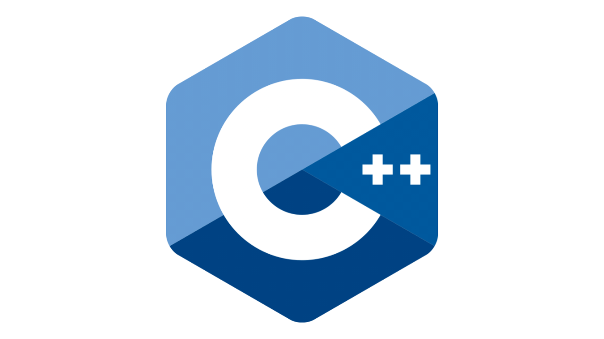

<a href="https://en.m.wikipedia.org/wiki/C%2B%2B">Wikipedia</a> •
<a href="https://devdocs.io/cpp/">Documentation</a> •
<a href="https://github.com/xHak1m/CPP-Programming/tree/main/docs/resources">Resources</a>

<h3 align="center">What is C++?</h3>

C++ is a powerful, general-purpose programming language created by Bjarne Stroustrup in 1983 as an extension of C.

It is widely used in game development, system programming, operating systems,and embedded systems.

Quick Fact: C++ combines procedural and object-oriented programming features.

<h3 align="center">Why C++?</h3>

Efficiency: C++ provides fine control over system resources and memory.

Applications: Used in game engines (Unreal Engine), operating systems, IoT devices, and even financial software.

Performance: It is faster than most high-level languages like Python or Java.

<h3 align="center">Setting Up Environment</h3>

On Windows: Install [MinGW](https://sourceforge.net/projects/mingw/) or [Visual Studio](https://visualstudio.microsoft.com/the)

On Android: Install [Coding C++](https://play.google.com/store/apps/details?id=com.kvassyu.coding2.cpp)

On Mac: Use [Clang](https://clang.llvm.org/) (comes with Xcode)

On Linux: Install g+* (GCC Compiler)
-
Via Terminal:

``sudo apt update``

``sudo apt install g++``
